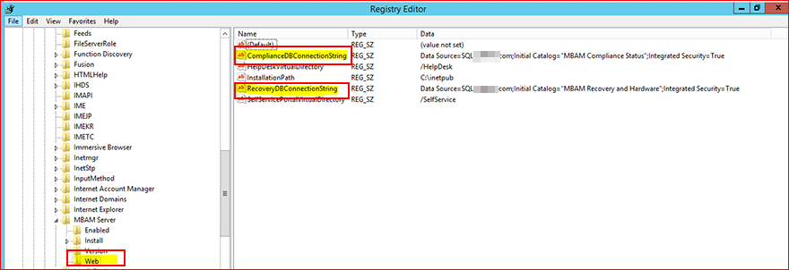
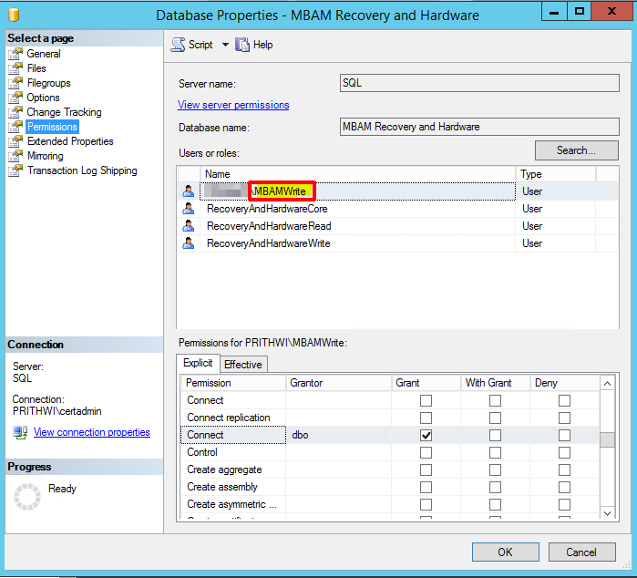
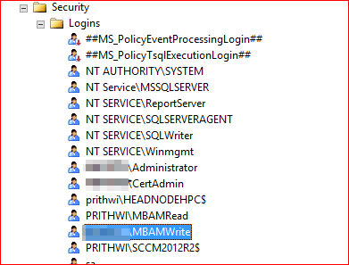
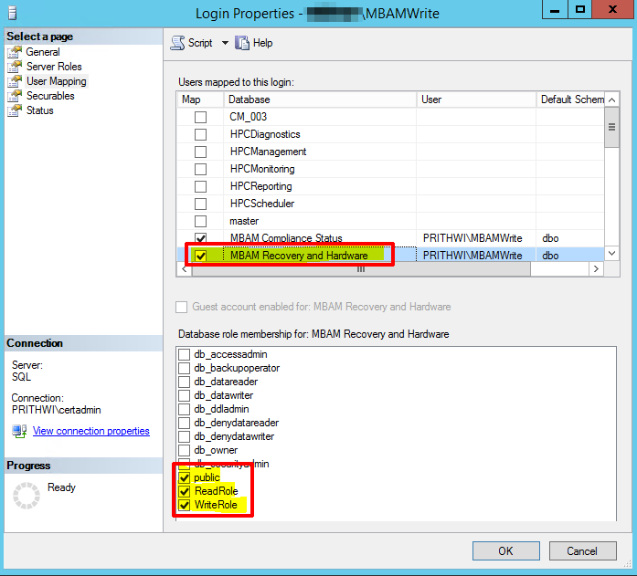
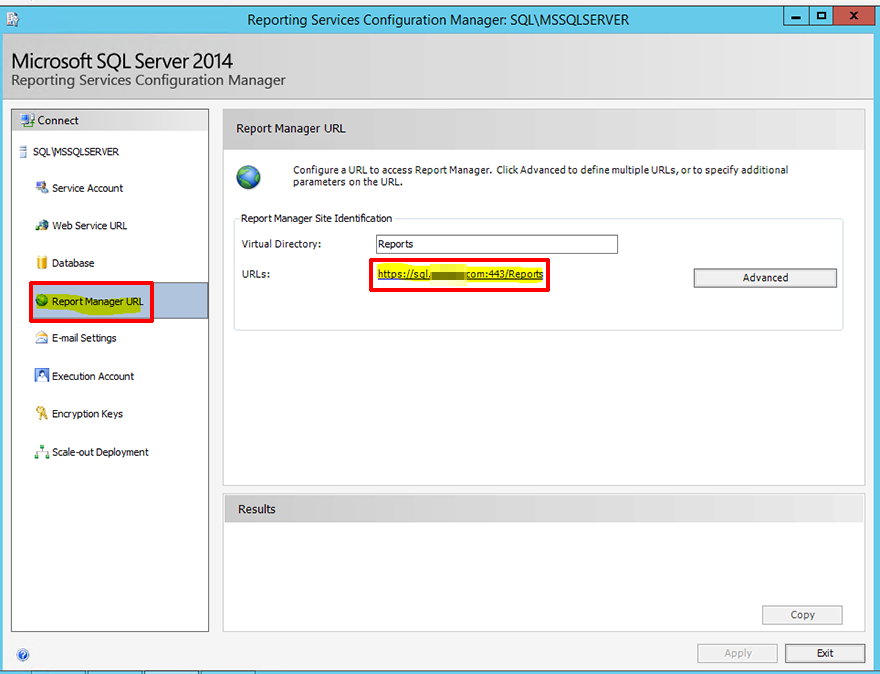
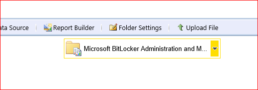
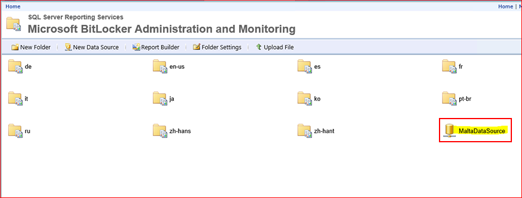
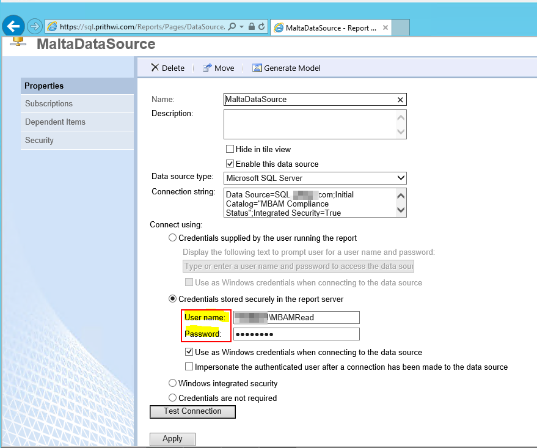

---
title: Troubleshooting MBAM 2.5 installation problems
description: Introducing how to troubleshoot MBAM 2.5 installation problems.
author: Deland-Han
ms.reviewer: dcscontentpm
manager: dansimp
ms.author: delhan
ms.sitesec: library
ms.prod: w10
ms.date: 09/16/2019
--- 

# Troubleshooting MBAM 2.5 installation problems

This article introduces how to troubleshoot Microsoft BitLocker Administration and Monitoring (MBAM) 2.5 installation issues in a standalone configuration.

## Referring MBAM log files for troubleshooting

MBAM includes logging for server installation, client installation, and events. This logging should be referred to for troubleshooting. 
 
### MBAM server installation log files

MBAMServerSetup.exe generates the following log files in the user’s %temp% folder during MBAM installation:<br /> **Microsoft_BitLocker_Administration_and_Monitoring_<14 numbers>.log**

MBAMServerSetup.exe logs the actions that were taken during MBAM setup and MBAM server feature installation:<br /> **Microsoft_BitLocker_Administration_and_Monitoring_<14_numbers>_0_MBAMServer.msi.log**

MBAMServerSetup.exe logs additional actions that were taken during installation.

### MBAM client installation log file

The client installation is recorded in the following log file in the %temp% folder (or a custom location, depending on how the client was installed): <br />**MSI\<five random characters\>.log**

This log contains the actions that are taken during MBAM client installation.
 
### MBAM client event-logging channel

MBAM has separate event-logging channels. The Admin, Analytical, and Operational log files are located in Event Viewer, under **Application and Services Logs** > **Microsoft** > **Windows** > **MBAM**.

The following table provides a brief description of each event log.
 
|Event log|	Description|
|----------|-------|
|Microsoft-Windows-MBAM/Admin|	Contains error messages|
|Microsoft-Windows-MBAM/Analytic|	Contains advanced logging information|
|Microsoft-Windows-MBAM/Operational|	Contains success messages|

### MBAM server event-logging channel

The log files are located in Event Viewer, under **Application and Services Logs** > **Microsoft** > **Windows** > **MBAM**. The following table includes server event logs that were introduced in MBAM 2.5:

|Event log|	Description|
|--------|-------------|
|Microsoft-Windows-MBAM/Admin|	Contains error messages|
|Microsoft-Windows-MBAM/Analytic|	Contains advanced logging information|
|Microsoft-Windows-MBAM/Operational|	Contains success messages|

### MBAM web service logs

Each MBAM web service log writes logging information to an SVCLOG file. By default, each web service writes the trace file under a folder that uses its name in the C:\inetpub\Microsoft BitLocker Management Solution\Logs folder.

You can use the service trace viewer tool (part of Microsoft Visual Studio) to review the svclog traces.

## Troubleshooting encryption and reporting issues

This section contains troubleshooting information for server functionality, client functionality, configuration settings, and known issues:
 
### MBAM client installation, Group Policy settings

Determine whether the MBAM agent is installed on the client computer. When MBAM is installed, it creates a service that is named BitLocker Management Client Service. This service is configured to start automatically. Determine whether the service is running.

Make sure that MBAM Group Policy settings are applied on the client computer. The following registry subkey is created if the Group Policy settings were applied on the client computer:
**HKEY_LOCAL_MACHINE\SOFTWARE\Policies\Microsoft\FVE\MDOPBitLockerManagement**

Verify that this key exists and is populated by using values per Group Policy settings.

### MBAM Agent in the initial delay period

The MBAM client doesn't start the operation immediately after installation. There is an initial random delay of 1–18 minutes before the MBAM Agent starts its operation. In addition to the initial delay, there is a delay of at least 90 minutes. (The delay depends on the Group Policy settings that are configured for the frequency of checking the client status.) Therefore, the total delay before a client starts operation is *random startup delay* + *client checking frequency delay*.

If the Operational and Admin event logs are blank, the client has not started the operation yet and is in the delay period that was mentioned earlier. If you want to bypass the delay, follow these steps:
 
1. Stop the BitLocker Management Client Service service.

2. Under the **HKEY_LOCAL_MACHINE\SOFTWARE\Microsoft\MBAM** registry subkey, create the **NoStartupDelay** registry value, set its type to **REG_DWORD**, and then set its value to **1**.

3. Under **HKEY_LOCAL_MACHINE\SOFTWARE\Policies\Microsoft\FVE\MDOPBitLockerManagement**, set the **ClientWakeupFrequency** and **StatusReportingFrequency** values to **1**. These values will revert to their original settings after Group Policy updates are on the computer.

4. Start the BitLocker Management Client Service service.

After the service starts, if you log in locally on the computer and there are no errors, you should receive a request to encrypt the computer within one minute. If you do not receive a request, you should review the MBAM Admin logs for any error entries.

### Computer does not have a TPM device, or the TPM device is not enabled in the BIOS

Review the MBAM Admin event log. You will see an event entry that resembles the following in the MBAM Admin event log:

    Log Name:      Microsoft-Windows-MBAM/Admin
    Source:        Microsoft-Windows-MBAM
    Date:          8/3/2013 12:31:10 PM
    Event ID:      9
    Task Category: None
    Level:         Error
    Keywords:      
    User:          SYSTEM
    Computer:      Mbamclient.contoso.com
    Description:
    The TPM hardware is missing.
    TPM is needed to encrypt the operating system drive with any TPM protector.

Open TPM Management (tpm.msc), and check whether the computer has a TPM device. If tpm.msc does not show a device, open Device Manager (devmgmt.msc), and check for a Trusted Platform Module under Security Devices. If you do not see a Trusted Platform Module device, this might be true for one of the following reasons:

* Your system doesn't have a Trusted Platform Module (TPM/Security) device.

* The TPM device is disabled in the BIOS.

* TPM Device is enabled in the BIOS, but management of the TPM device from the operating system setting is disabled in the BIOS.

* You aren't using a Microsoft driver for the TPM device. Review the devices that are listed in device manager to identify the Microsoft TPM device driver.

If the TPM device is not using the C:\Windows\System32\tpm.sys driver, you should update the driver by selecting the C:\Windows\Inf\tpm.inf file.

### Computer does not have a valid SYSTEM partition

Review the MBAM Admin event log. You will see an event entry that resembles the following in the MBAM Admin event log:

    Log Name:      Microsoft-Windows-MBAM/Admin
    Source:        Microsoft-Windows-MBAM
    Date:          8/3/2013 4:13:37 AM
    Event ID:      8
    Task Category: None
    Level:         Error
    Keywords:      
    User:          SYSTEM
    Computer:      BITTESTVM.xtremelabs.com
    Description:
    The system volume is missing.
    SystemVolume is needed to encrypt the operating system drive.

BitLocker requires a SYSTEM partition to enable encryption ([BitLocker Drive Encryption in Windows 7: Frequently Asked Questions](https://docs.microsoft.com/previous-versions/windows/it-pro/windows-7/ee449438(v=ws.10)?redirectedfrom=MSDN#bkmk_partitions)).

MBAM doesn't create the system partition automatically. You can use the BitLocker drive preparation utility (bdehdcfg.exe) to create the system partition and move the required startup files.

For example, you can use the command **%windir%\system32\bdeHdCfg.exe -target default -size 300 –quiet** to prepare the drive silently before you deploy MBAM to encrypt the drives. This requires a restart. You can also script the action if this is required. The following document describes the BitLocker Drive Preparation Tool:

[Description of the BitLocker Drive Preparation Tool](https://support.microsoft.com/help/933246)

### Drives are not formatted to have a compatible file system

See the [TechNet article for file system requirements for BitLocker](https://docs.microsoft.com/previous-versions/windows/it-pro/windows-7/ee449438(v=ws.10)?redirectedfrom=MSDN#bkmk_hsrequirements).

### Group Policy conflict

You will see an event entry that resembles the following in the MBAM Admin event log:

    Log Name:      Microsoft-Windows-MBAM/Admin
    Source:        Microsoft-Windows-MBAM
    Date:          7/25/2013 9:27:58 PM
    Event ID:      22
    Task Category: None
    Level:         Error
    Keywords:      
    User:          SYSTEM
    Computer:      Mbamclient.contoso.com
    Description:
    Detected Fixed Data Drive volume encryption policies conflict.
    Check BitLocker and MBAM policies related to FDD drive protectors.

Verify your Group Policy settings to make sure that you do not have a conflicting setting among the MBAM Group Policy settings.

You should configure Group Policy by using the MDOP MBAM template and not the BitLocker Drive Encryption template.

For example:

Under Operating system drive encryption settings, you selected TPM as the protector, and you also selected **Allow enhanced PINs for startup**. These are conflicting settings because TPM-only protection doesn't require a PIN. Therefore, you should disable the enhanced PINs setting.

### User may have requested an exemption

If you enabled the Computer Configuration\Administrative Templates\Windows Components\MDOP MBAM (BitLocker Management)\Client Management\Configure user exemption policy Group Policy setting, users will be offered the option to request an exemption.

By default, if the user requests an exemption, the exemption will be valid for 7 days, and the user will not receive prompts to encrypt during this period. (The default value can be increased or decreased during policy configuration.) After the exemption period is over, the user is prompted to encrypt.

You will see the following entry in the MBAM Admin event log when a computer is under user exemption:

    Log Name:      Microsoft-Windows-MBAM/Admin
    Source:        Microsoft-Windows-MBAM
    Date:          8/3/2013 3:06:40 PM
    Event ID:      13
    Task Category: None
    Level:         Warning
    Keywords:      
    User:          SYSTEM
    Computer:      MBAMCLIENT.contoso.com
    Description:
    The user is exempt from encryption.

If you want to manually override user exemption for a computer, follow these steps:
 
1. Set the AllowUserExemption value to **0** under the following registry subkey: <br />
**HKEY_LOCAL_MACHINE\SOFTWARE\Policies\Microsoft\FVE\MDOPBitLockerManagement**

2. Delete all the registry values under the following registry subkey except for **AgentVersion**, **EncodedComputerName**, and **Installed**:<br />
**HKEY_LOCAL_MACHINE\SOFTWARE\Microsoft\MBAM**

    **Note** You must restart the MBAM agent for the changes to take effect.

Be aware that after you apply Group Policy to the computer, these values may revert to their original settings.

### WMI issue

MBAM uses methods of the win32_encryptablevolume class to manage BitLocker. If this module is unregistered or corrupted, the MBAM client will not operate correctly, and you will see the following event entry in the MBAM Admin event log:

    Log Name:      Microsoft-Windows-MBAM/Admin
    Source:        Microsoft-Windows-MBAM
    Date:          7/27/2013 11:18:51 PM
    Event ID:      4
    Task Category: None
    Level:         Error
    Keywords:      
    User:          SYSTEM
    Computer:      BITTEST.xtremelabs.com
    Description:
    An error occurred while sending encryption status data.
    Error code:
    0x80041016 
    Details:
    NULL

Additionally, you may notice that the Recovery and Hardware policies do not apply with Error Code 0x8007007e. This translates to "The specified module could not be found."

To resolve this issue, you should reregister the **win32_encryptablevolume** class by using the following command:

```cmd
mofcomp c:\Windows\System32\wbem\win32_encryptablevolume.mof
```

## Troubleshooting MBAM Agent communication issues

This section contains troubleshooting information for the following issues that are related to MBAM agent communication:

### Incorrect MBAM service URL

If the value of MBAM Compliance Status Service or Recovery and Hardware Service is incorrect, you'll see an event entry that resembles the following in the MBAM Admin event log on the client computer:

    Log Name:      Microsoft-Windows-MBAM/Admin
    Source:        Microsoft-Windows-MBAM
    Date:          8/3/2013 4:13:36 PM
    Event ID:      4
    Task Category: None
    Level:         Error
    Keywords:     
    User:          SYSTEM
    Computer:      Mbamclient.contoso.com
    Description:
    An error occurred while sending encryption status data.
    Error code:
    0x803d0010
    Details:
    The remote endpoint was not reachable.

    Log Name:      Microsoft-Windows-MBAM/Admin
    Source:        Microsoft-Windows-MBAM
    Date:          8/3/2013 4:13:33 PM
    Event ID:      18
    Task Category: None
    Level:         Error
    Keywords:     
    User:          SYSTEM
    Computer:      Mbamclient.contoso.com
    Description:
    Unable to connect to the MBAM Recovery and Hardware service.
    Error code:
    0x803d0010
    Details:
    The remote endpoint was not reachable.

    Log Name:      Microsoft-Windows-MBAM/Admin
    Source:        Microsoft-Windows-MBAM
    Date:          8/3/2013 4:20:32 PM
    Event ID:      4
    Task Category: None
    Level:         Error
    Keywords:     
    User:          SYSTEM
    Computer:      Mbamclient.contoso.com
    Description:
    An error occurred while sending encryption status data.
    Error code:
    0x803d0020
    Details:
    The endpoint address URL is invalid.

    Log Name:      Microsoft-Windows-MBAM/Admin
    Source:        Microsoft-Windows-MBAM
    Date:          8/3/2013 4:20:32 PM
    Event ID:      18
    Task Category: None
    Level:         Error
    Keywords:     
    User:          SYSTEM
    Computer:      Mbamclient.contoso.com
    Description:
    Unable to connect to the MBAM Recovery and Hardware service.
    Error code:
    0x803d0020
    Details:
    The endpoint address URL is invalid.

Verify the values of **KeyRecoveryServiceEndPoint** and **StatusReportingServiceEndpoint** under the following registry subkey on the client computer: <br />
**HKEY_LOCAL_MACHINE\SOFTWARE\Policies\Microsoft\FVE\MDOPBitLockerManagement**

By default, the URL for KeyRecoveryServiceEndPoint (MBAM Recovery and Hardware service endpoint) is in the following format: <br />
**http://\<servername\>:\<port\>/MBAMRecoveryAndHardwareService/CoreService.svc**

By default, the URL for StatusReportingServiceEndpoint (MBAM Status reporting service endpoint) is in the following format:<br />
**http://\<servername\>:\<port\>/MBAMComplianceStatusService/StatusReportingService.svc**

> [!Note]
> There should be no spaces in the URL.

If the service URL is incorrect, you should correct the service URL in the following Group Policy setting:

**Computer configuration** > **Policies** > **Administrative Templates** > **Windows Components** > **MDOP MBAM (BitLocker Management)** > **Client Management** > **Configure MBAM Services**

### Connectivity issue that affects the MBAM administration server

The MBAM agent will be unable to post any updates to the database if connectivity issues exist between the client agent and the MBAM administration server. In this case, you will notice connectivity failure entries in the MBAM Admin event log on the client computer:

    Log Name:      Microsoft-Windows-MBAM/Admin
    Source:        Microsoft-Windows-MBAM
    Date:          29-04-2014 18:21:22
    Event ID:      2
    Task Category: None
    Level:         Error
    Keywords:     
    User:          SYSTEM
    Computer:      TESTLABS.CONTOSO.COM
    Description:
    An error occurred while applying MBAM policies.
    Volume ID:\\?\Volume{871c5858-2467-4d0b-8c83-d68af8ce10e5}\ 
    Error code:
    0x803D0010 
    Details:
    The remote endpoint was not reachable.
 
    Log Name:      Microsoft-Windows-MBAM/Admin
    Source:        Microsoft-Windows-MBAM
    Date:          29-04-2014 23:06:48
    Event ID:      2
    Task Category: None
    Level:         Error
    Keywords:     
    User:          SYSTEM
    Computer:      TESTLABS.CONTOSO.COM
    Description:
    An error occurred while applying MBAM policies.
    Volume ID:\\?\Volume{871c5858-2467-4d0b-8c83-d68af8ce10e5}\ 
    Error code:
    0x803D0006 
    Details:
    The operation did not complete within the time allotted.

    Log Name:      Microsoft-Windows-MBAM/Admin
    Source:        Microsoft-Windows-MBAM
    Date:          02-09-2013 02:02:04
    Event ID:      18
    Task Category: None
    Level:         Error
    Keywords:     
    User:          SYSTEM
    Computer:      TESTLABS.CONTOSO.COM
    Description:
    Unable to connect to the MBAM Recovery and Hardware service.
    Error code:
    0x803D0010 
    Details:
    The remote endpoint was not reachable.

Basic checks:

* Verify basic connectivity by pinging the MBAM administration server by name and IP. Check whether you can connect to the MBAM administration website or service port by using telnet or portqry.

* Verify that the IIS service is running on the MBAM administration and monitoring server and that the MBAM web service is listening on the same port that is configured on the MBAM client computer (`netstat –ano | find "portnumber"`).

* Verify that the port number that is configured for the MBAM website is using IIS Manager (inetmgr). Make sure that the port number is the same as the port number on which the client is listening. Make sure that the port number is not shared by another application. For example, another application on the server should not be using the same port.

* If there is a firewall, make sure that the port is open in the firewall or proxy server.

* If the communication between client and server is secure, make sure that you are using a valid SSL certificate.

* Verify network connectivity between the web server and the database server to which the data is sent for insertion. You can check database connectivity from the web server to the database server by using ODBC Data Source Administrator. Detailed SQL Server connection troubleshooting information is available in [How to Troubleshoot Connecting to the SQL Server Database Engine](https://social.technet.microsoft.com/wiki/contents/articles/2102.how-to-troubleshoot-connecting-to-the-sql-server-database-engine.aspx).

#### Troubleshooting the connectivity issue

Make sure that the service URL that is configured on the client is correct. Copy the value of the URL for KeyRecoveryServiceEndPoint (**HKEY_LOCAL_MACHINE\SOFTWARE\Policies\Microsoft\FVE\MDOPBitLockerManagement**) from the registry, and open it in Internet Explorer.

Similarly, copy the value of the URL for StatusReportingServiceEndpoint (**HKEY_LOCAL_MACHINE\SOFTWARE\Policies\Microsoft\FVE\MDOPBitLockerManagement**), and open it in Internet Explorer.

> [!Note]
> If you cannot browse to the URL from the client computer, you should test basic network connectivity from the client to the server that is running IIS. See points 1, 2, 3, and 4 in the previous section.

Additionally, review the Application logs on the administration and monitoring server for any errors.

You can make a concurrent network trace between the client and the server, and review the trace to determine the cause of connection failure between the client agent and the MBAM administration server.

> [!Note]
> If you can browse to the service URLs from the client computer and there are connectivity error entries in the MBAM admin event logs, this might be because of a connectivity failure between the administration server and the database server.

If you can successfully browse to both service URLs, and there is connectivity between the client and the server that is running, IIS is working. However, there may be a problem in communication between the server that is running IIS and the database server.

The MBAM services may be unable to connect to the database server because of a network issue or an incorrect database connection string setting. Review the Application logs on the administration and monitoring server. You might see errors entries or warnings from source ASP.NET 2.0.50727.0 that resemble the following log entry:

    Log Name:      Application
    Source:        ASP.NET 2.0.50727.0
    Date:          7/11/2013 6:16:34 PM
    Event ID:      1310
    Task Category: Web Event
    Level:         Warning
    Keywords:      Classic
    User:          N/A
    Computer:      MBAM2-Admin.contoso.com
    Description:
    Event code: 100001
    Event message: SQL error occurred
    Event time: 7/11/2013 6:16:34 PM
    Event time (UTC): 7/11/2013 12:46:34 PM
    Event ID: 6615fb8eb9d54e778b933d5bb7ca91ed
    Event sequence: 2
    Event occurrence: 1
    Event detail code: 0 
    Application information:
        Application domain: /LM/W3SVC/2/ROOT/MBAMAdministrationService-1-130180202570338699
        Trust level: Full
        Application Virtual Path: /MBAMAdministrationService
        Application Path: C:\inetpub\Microsoft BitLocker Management Solution\Administration Service\
        Machine name: MBAM2-ADMIN 
    
    Process information:
        Process ID: 1940
        Process name: w3wp.exe
        Account name: NT AUTHORITY\NETWORK SERVICE 
    
    Exception information:
        Exception type: SqlException
        Exception message: A network-related or instance-specific error occurred while establishing a connection to SQL Server. The server was not found or was not accessible. Verify that the instance name is correct and that SQL Server is configured to allow remote connections. (provider: Named Pipes Provider, error: 40 - Could not open a connection to SQL Server) 
    
    Request information:
        Request URL: 
        Request path: 
        User host address: 
        User: 
        Is authenticated: False
        Authentication Type: 
        Thread account name: NT AUTHORITY\NETWORK SERVICE 
    
    Thread information:
        Thread ID: 7
        Thread account name: NT AUTHORITY\NETWORK SERVICE
        Is impersonating: False
        Stack trace:    at System.Data.SqlClient.SqlInternalConnection.OnError(SqlException exception, Boolean breakConnection)
       at System.Data.SqlClient.TdsParser.ThrowExceptionAndWarning(TdsParserStateObject stateObj)
       at System.Data.SqlClient.TdsParser.Connect(ServerInfo serverInfo, SqlInternalConnectionTds connHandler, Boolean ignoreSniOpenTimeout, Int64 timerExpire, Boolean encrypt, Boolean trustServerCert, Boolean integratedSecurity, SqlConnection owningObject)
       at System.Data.SqlClient.SqlInternalConnectionTds.AttemptOneLogin(ServerInfo serverInfo, String newPassword, Boolean ignoreSniOpenTimeout, Int64 timerExpire, SqlConnection owningObject)
       at System.Data.SqlClient.SqlInternalConnectionTds.LoginNoFailover(String host, String newPassword, Boolean redirectedUserInstance, SqlConnection owningObject, SqlConnectionString connectionOptions, Int64 timerStart)
       at System.Data.SqlClient.SqlInternalConnectionTds.OpenLoginEnlist(SqlConnection owningObject, SqlConnectionString connectionOptions, String newPassword, Boolean redirectedUserInstance)
       at System.Data.SqlClient.SqlInternalConnectionTds..ctor(DbConnectionPoolIdentity identity, SqlConnectionString connectionOptions, Object providerInfo, String newPassword, SqlConnection owningObject, Boolean redirectedUserInstance)
       at System.Data.SqlClient.SqlConnectionFactory.CreateConnection(DbConnectionOptions options, Object poolGroupProviderInfo, DbConnectionPool pool, DbConnection owningConnection)
       at System.Data.ProviderBase.DbConnectionFactory.CreatePooledConnection(DbConnection owningConnection, DbConnectionPool pool, DbConnectionOptions options)
       at System.Data.ProviderBase.DbConnectionPool.CreateObject(DbConnection owningObject)
       at System.Data.ProviderBase.DbConnectionPool.UserCreateRequest(DbConnection owningObject)
       at System.Data.ProviderBase.DbConnectionPool.GetConnection(DbConnection owningObject)
       at System.Data.ProviderBase.DbConnectionFactory.GetConnection(DbConnection owningConnection)
       at System.Data.ProviderBase.DbConnectionClosed.OpenConnection(DbConnection outerConnection, DbConnectionFactory connectionFactory)
       at System.Data.SqlClient.SqlConnection.Open()
       at System.Data.Linq.SqlClient.SqlConnectionManager.UseConnection(IConnectionUser user)
       at System.Data.Linq.SqlClient.SqlProvider.get_IsSqlCe()
       at System.Data.Linq.SqlClient.SqlProvider.InitializeProviderMode()
       at System.Data.Linq.SqlClient.SqlProvider.System.Data.Linq.Provider.IProvider.Execute(Expression query)
       at System.Data.Linq.DataContext.ExecuteMethodCall(Object instance, MethodInfo methodInfo, Object[] parameters)
       at Microsoft.Mbam.Server.ServiceCommon.KeyRecoveryModelDataContext.GetRecoveryKeyIds(String partialRecoveryKeyId, String reason)
       at Microsoft.Mbam.ApplicationSupportService.AdministrationService.GetRecoveryKeyIds(String partialRecoveryKeyId, String reasonCode)
    
    Custom event details:
        Application: MBAMAdministrationService
        Sql Server:
        Database: MBAM Recovery and Hardware
        Database: MBAM Compliance Status
        Sql ErrorCode: 5
        Error Message: A network-related or instance-specific error occurred while establishing a connection to SQL Server. The server was not found or was not accessible. Verify that the instance name is correct and that SQL Server is configured to allow remote connections. (provider: Named Pipes Provider, error: 40 - Could not open a connection to SQL Server)

#### Possible causes

##### Cause 1

The administrator may have specified an invalid database instance name/database name during installation of administration and monitoring server components.

You can verify and correct the database connection strings by using the IIS Management console. To do this, open IIS Manager, and browse to Microsoft BitLocker Administration and Monitoring. For each service that is listed on the left side, follow these steps to change the database connection strings:

1. In **Features View**, double-select **Connection Strings**.

2. On the **Connection Strings** page, select the connection string that you want to change.

3. In the **Actions** pane, select **Edit**.

4. In the **Edit Connection String** dialog box, change the properties that you want to change, and then select **OK**.

##### Cause 2

SQL Server port blocked in firewall. Verify the port number to which SQL Server is configured to listen, and make sure that the port is open in the firewall between the administration server and database server.

##### Cause 3

Incorrect SQL server TCP/IP bindings. Verify SQL TCP/IP bindings in SQL Server Configuration Manager on the database server. MBAM requires that the TCP/IP and Named Pipes protocols are enabled to connect to the database.

##### Cause 4

The NT Authority\Network Service account or the MBAM Administration Server’s computer account doesn't have the required permissions to connect to the SQL database.

During the installation of database components on the database server, the installer creates two local groups: MBAM Compliance Auditing DB Access and MBAM Recovery and Hardware DB Access.

The NT Authority\Network Service account, the MBAM administration server’s computer account, and the user who installs the database components are automatically added to these groups.

These groups are granted the required permissions on the database during the installation. All users who are part of this group automatically receive the required permissions on the database.

The web service may not connect to the database server because of a permissions issue if one or more of the following conditions are true:

* The groups that were mentioned earlier are removed from the local groups on the database server.

* The NT Authority\Network Service account and the MBAM administration server’s computer account are not members of these groups.

* These groups do not have the required permissions on the database.

You will notice permissions-related errors in the Application logs on the MBAM administration and monitoring server if any of the previous conditions are true. In that case, you should manually add the NT Authority\Network Service account and MBAM administration server’s computer account and grant them a server-wide public role on the SQL database server that is using SQL Server Management Studio (https://msdn.microsoft.com/library/aa337562.aspx).

#### Review the web service logs

If no events are logged in the Application logs on the MBAM administration server, it’s time to review the web service logs (.svclog) of the MBAM web service that is hosted on the MBAM administration and monitoring server. You will have to use the Service Trace Viewer Tool (SvcTraceViewer.exe) https://msdn.microsoft.com/library/ms732023.aspx to view the log file.

You should primarily investigate the service trace logs of RecoveryandHardwareService and ComplianceStatusService. By default, web service logs are located in the C:\inetpub\Microsoft BitLocker Management Solution\Logs folder. There, each service writes its .svclog file under its own folder.

Review the activity in the service trace log for any error or warning entries. By default, error entries are highlighted in red. Select the error description on the right pane of the trace viewer to view detailed information about the error entry. The following is a sample error entry from the trace log:

    <E2ETraceEvent xmlns="http://schemas.microsoft.com/2004/06/E2ETraceEvent">
    <System xmlns="http://schemas.microsoft.com/2004/06/windows/eventlog/system">
    <EventID>15183</EventID>
    <Type>3</Type>
    <SubType Name="Error">0</SubType>
    <Level>2</Level>
    <TimeCreated SystemTime="2013-07-05T14:48:06.2821550Z" />
    <Source Name="Microsoft.Mbam.CoreService" />
    <Correlation ActivityID="{00000000-0000-0000-0000-000000000000}" />
    <Execution ProcessName="w3wp" ProcessID="4332" ThreadID="11" />
    <Channel />
    <Computer>XXXXXXXXXXX</Computer>
    </System>
    <ApplicationData>AddUpdateVolume: While executing sql transaction for add volume to store exception occurred Key Recovery Data Store processing error: Violation of UNIQUE KEY constraint 'UniqueRecoveryKeyId'. Cannot insert duplicate key in object 'RecoveryAndHardwareCore.Keys'. The duplicate key value is (8637036e-b379-4798-bd9e-5a0b36296de3).
    </ApplicationData>
    </E2ETraceEvent>

## Re-installation or reconfiguration of MBAM infrastructure

To re-install or reconfigure MBAM infrastructure, you must know the following things:

* Application Pool account

* MBAM Groups (Helpdesk, Advanced, Report Users Group)

* MBAM Reports URL

* SQL Server name and database names

* MBAM ReadWrite and ReadOnly Accounts

### Application Pool account

To find the Application Pool account, log on to the MBAM Web Server, open **Internet Information Services (IIS) Manager**, and then select **Application Pools**:


The Service Principal Name (SPN) must be set in this account. This setting is very important to the functionality of MBAM.

### MBAM Groups (Helpdesk, Advanced, Report Users Group and Reports URL)


This provides information such as Helpdesk Group, Advanced Helpdesk Group, Report Users group, and MBAM Reports URL. The MBAM Reports URL must be provided in the MBAM setup and should read as: http(s)://servername/ReportServer.

### SQL Server name and database (DB) names

To find the SQL Server names and instances hosting the MBAM DBs, log on to the MBAM Web (IIS) server and browse to the folowing registry subkey:

**HKEY_LOCAL_MACHINE\SOFTWARE\Microsoft\MBAM Server\Web**



The highlighted portions are connection strings. These should have the SQL Server name, database names, and instances (if named).

### MBAM ReadWrite and ReadOnly accounts

This information will be in the SQL Server database, for which we already found the name from the web server.

#### ReadWrite account

1. Log in to the SQL Management Studio.

2. Right-click **MBAM Recovery and Hardware**, select **Properties**, and then select **Permissions**.

For example, The the lab account name is **MBAMWrite**. The Application Pool and ReadWrite accounts are set to be the same.




Browse to **Security** and then **Logins** in SQL Management Studio. Browse to the account shown in the previous screenshot.



Right-click the accounts, go to **Properties User Mapping**, and locate the MBAM Recovery and Hardware database:



#### ReadOnly account

Open SQL Server Reporting Services Configuration Manager on the SSRS Server. Select **Report Manager URL**, and then browse the **URLs**:



Select **Microsoft Bitlocker Administration and Monitoring**:



Select **MaltaDatasource**:





MaltaDataSource should have the ReadOnly Account name and should be used in MBAM setup.

## Reference

For more information, see the following articles:

[Deploying MBAM 2.5 in a standalone configuration](https://support.microsoft.com/help/3046555)

[Microsoft BitLocker Administration and Monitoring 2.5](https://docs.microsoft.com/microsoft-desktop-optimization-pack/mbam-v25/)
