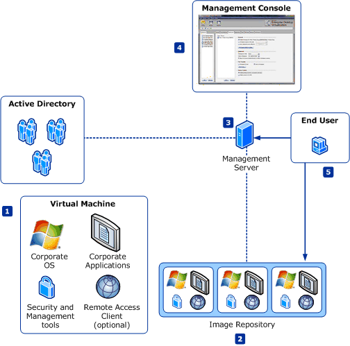

# MED-V High-Level Architecture

The MED-V solution comprises the following elements:

-   **Administrator-defined virtual machine**—Encapsulates a full desktop environment, including an operating system, applications, and optional management and security tools.

-   **Image repository**—Stores all virtual images on a standard IIS server and enables virtual images version management, client-authenticated image retrieval, and efficient download (of a new image or updates) via Trim Transfer technology.

-   **Management server**—Associates virtual images from the image repository along with administrator usage policies to Active Directory® users or groups. The management server also aggregates clients' events and stores them in an external database (Microsoft SQL Server®) for monitoring and reporting purposes.

-   **Management console**—Enables administrators to control the management server and the image repository.

-   **End-user client**

    1.  Virtual image life-cycle—Authentication, image retrieval, enforcement of usage policies.

    2.  Virtual machine session management—Start, stop, lock the virtual machine.

    3.  Single desktop experience—Applications installed in the virtual machine seamlessly available through the standard desktop Start menu and integrated with other applications on the user desktop.

All communication between the client and the servers (management server and image repository) is carried on top of a standard HTTP or HTTPS channel.

